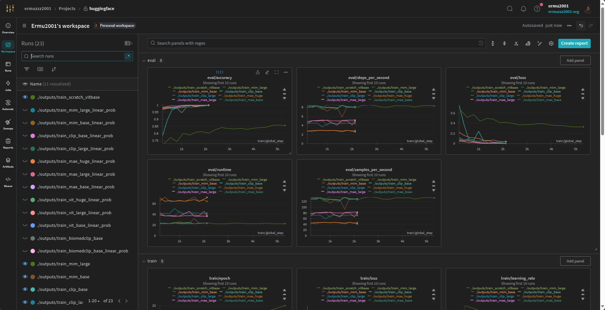

# Lung Colon Cancer classification on Medical Imaging utilizing ViT

## Install
```
conda create -n dlp python=3.10
conda activate dlp
pip install -r requirements.raw.txt
```

## Explores data and Baseline Model Training
Use jupyter notebook on cnn_train.ipynb

## Download data
```
wget https://huggingface.co/datasets/ermu2001/LungColonCancerClassification/resolve/main/lung_colon_dataset.zip
unzip lung_colon_dataset.zip
```

## Train

1. To Train the ViT Base from scratch, execute this:
```bash
bash train.sh
```

2. To Finetune And Linear Prob each ViT, execute this:
```bash
bash run_experiments.sh
```

## Results

You can find all the ViTs' training logs and curves at our [wandb log repo](https://wandb.ai/ermuzzz2001/huggingface). A screenshot is taken here for simplicity. Please click the link to see the training logs



For all terminal outputs of the ViTs, you can see any links variant as outputs/*/train.log, for example: [outputs/train_biomedclip_base/train.log](outputs/train_biomedclip_base/train.log)
